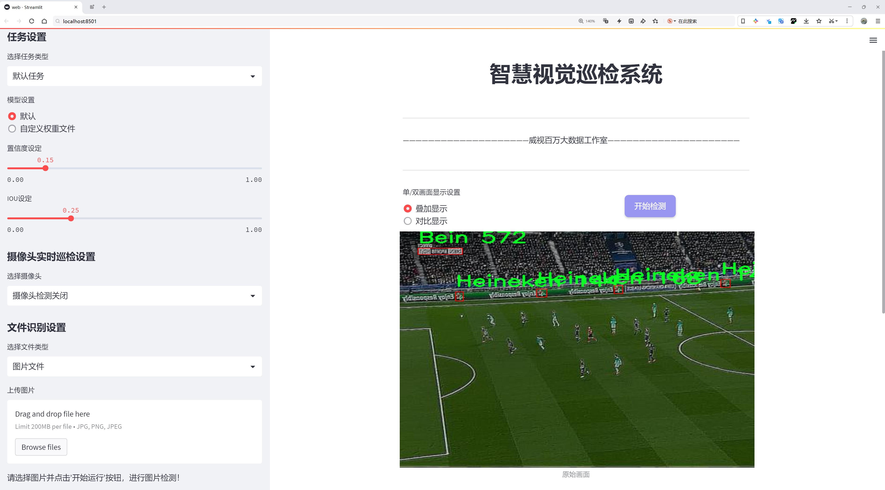
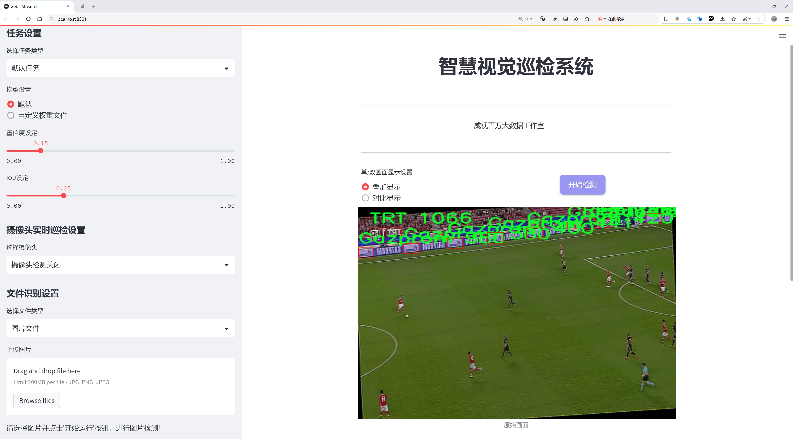
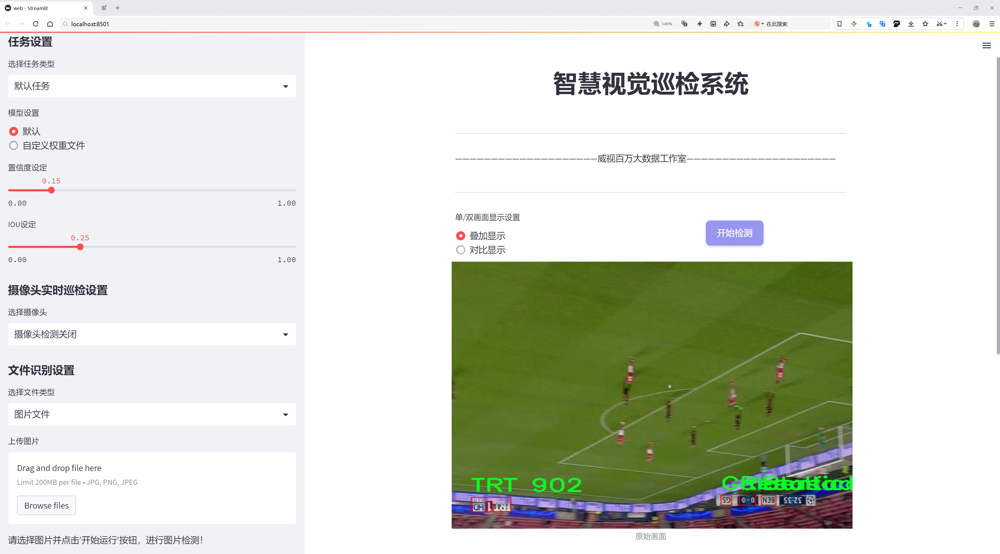
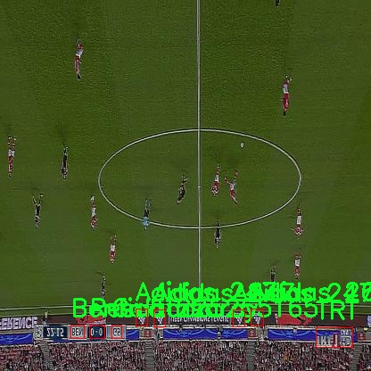
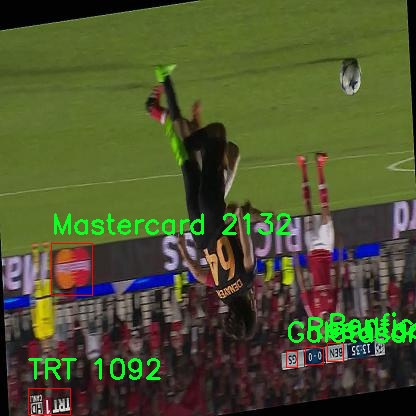
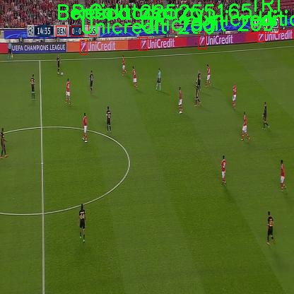
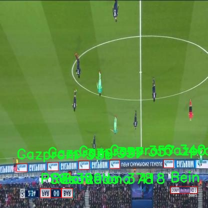
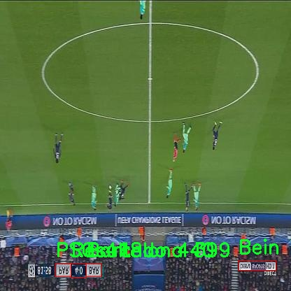

# 体育品牌标志检测检测系统源码分享
 # [一条龙教学YOLOV8标注好的数据集一键训练_70+全套改进创新点发刊_Web前端展示]

### 1.研究背景与意义

项目参考[AAAI Association for the Advancement of Artificial Intelligence](https://gitee.com/qunmasj/projects)

项目来源[AACV Association for the Advancement of Computer Vision](https://github.com/qunshansj/good)

研究背景与意义

随着全球体育产业的蓬勃发展，体育品牌的市场竞争愈发激烈，品牌标志作为品牌识别的重要元素，其检测与识别的准确性和效率直接影响到品牌营销和消费者体验。在这一背景下，计算机视觉技术的快速进步为体育品牌标志的自动检测提供了新的解决方案。尤其是YOLO（You Only Look Once）系列目标检测算法，以其高效的实时检测能力和较高的准确率，成为了研究者和工程师们关注的焦点。YOLOv8作为该系列的最新版本，进一步提升了检测精度和速度，适用于多种复杂场景的目标检测任务。

本研究旨在基于改进的YOLOv8算法，构建一个高效的体育品牌标志检测系统。我们使用的数据集包含3705张图像，涵盖22个不同的体育品牌标志，包括Adidas、Barcelona、Juventus等知名品牌。这些品牌在全球范围内享有极高的知名度，具有广泛的市场影响力。通过对这些品牌标志的检测与识别，不仅可以为品牌营销提供数据支持，还可以为消费者提供更为个性化的服务体验。

在数据集的构建过程中，我们注重多样性和代表性，确保涵盖不同场景、不同光照条件下的品牌标志。这种多样性不仅提高了模型的泛化能力，也使得系统在实际应用中能够更好地适应不同的环境。通过对YOLOv8的改进，我们计划在模型结构、损失函数和训练策略等方面进行优化，以进一步提升检测的准确性和速度。

此外，体育品牌标志的检测系统在实际应用中具有广泛的意义。首先，它可以为体育赛事的直播、转播提供实时的品牌曝光分析，帮助品牌方更好地评估市场推广效果。其次，该系统还可以应用于社交媒体平台，通过对用户上传的图片进行自动标志识别，帮助品牌方了解消费者的品牌偏好和消费行为，从而优化市场策略。最后，在广告投放和品牌监测方面，该系统能够实时监控品牌标志的出现频率和位置，为品牌方提供有价值的数据支持。

综上所述，基于改进YOLOv8的体育品牌标志检测系统不仅具有重要的学术研究价值，也在实际应用中展现出广阔的前景。通过对该系统的研究与开发，我们希望能够推动计算机视觉技术在体育品牌营销领域的应用，为品牌方和消费者之间架起一座更加高效的沟通桥梁。同时，这一研究也为后续相关领域的研究提供了新的思路和方法，具有重要的理论意义和实践价值。

### 2.图片演示







##### 注意：由于此博客编辑较早，上面“2.图片演示”和“3.视频演示”展示的系统图片或者视频可能为老版本，新版本在老版本的基础上升级如下：（实际效果以升级的新版本为准）

  （1）适配了YOLOV8的“目标检测”模型和“实例分割”模型，通过加载相应的权重（.pt）文件即可自适应加载模型。

  （2）支持“图片识别”、“视频识别”、“摄像头实时识别”三种识别模式。

  （3）支持“图片识别”、“视频识别”、“摄像头实时识别”三种识别结果保存导出，解决手动导出（容易卡顿出现爆内存）存在的问题，识别完自动保存结果并导出到tempDir中。

  （4）支持Web前端系统中的标题、背景图等自定义修改，后面提供修改教程。

  另外本项目提供训练的数据集和训练教程,暂不提供权重文件（best.pt）,需要您按照教程进行训练后实现图片演示和Web前端界面演示的效果。

### 3.视频演示

[3.1 视频演示](https://www.bilibili.com/video/BV1WoHVeZEDR/?vd_source=ff015de2d29cbe2a9cdbfa7064407a08)

### 4.数据集信息展示

数据集信息展示

在本研究中，我们使用名为“projeto_fin”的数据集，旨在训练和改进YOLOv8模型，以实现对体育品牌标志的高效检测。该数据集包含22个类别，涵盖了广泛的体育品牌和相关标志，具体类别包括：Adidas、BTSport、Barcelona、Bein、Benfica、Compensa--o、Compensacao、Galatasaray、Gazprom、Heineken、Juventus、Lays、ManCity、Mastercard、Nissan、PSG、Pepsi、Playstation、Resultado、Sony、TRT和Unicredit。这些品牌不仅在体育领域内具有重要的市场地位，同时也在全球范围内享有广泛的知名度和影响力。

数据集的构建过程经过精心设计，确保涵盖了各个品牌的标志在不同场景和背景下的多样性。这种多样性对于训练一个能够在实际应用中表现出色的模型至关重要。每个类别的标志都经过精确标注，确保模型在学习过程中能够获得准确的信息。标志的图像来自于多种来源，包括体育赛事、广告宣传、社交媒体等，旨在模拟真实世界中可能遇到的各种情况。

在进行数据集的标注时，我们特别关注了标志的清晰度、对比度以及与背景的区分度。这些因素都会直接影响到YOLOv8模型的检测精度。为了提高模型的鲁棒性，我们还对数据集进行了数据增强处理，包括旋转、缩放、裁剪和颜色调整等操作。这些技术手段不仅丰富了数据集的多样性，还帮助模型更好地适应不同的视觉环境，从而提高其在实际应用中的表现。

通过使用“projeto_fin”数据集，我们期望能够训练出一个高效的体育品牌标志检测系统，能够在复杂的场景中快速、准确地识别出目标标志。这一系统的成功实现将为体育品牌的市场推广、赛事直播以及社交媒体监测等领域提供强有力的技术支持。

在模型训练过程中，我们将采用先进的深度学习技术和优化算法，以确保YOLOv8能够充分利用“projeto_fin”数据集中的信息。我们将定期评估模型的性能，调整超参数，以达到最佳的检测效果。最终，我们希望通过这一研究，不仅能够提升体育品牌标志的检测精度，还能为相关领域的研究提供新的思路和方法。

综上所述，“projeto_fin”数据集为我们改进YOLOv8模型提供了坚实的基础，其丰富的类别和多样的标志图像将极大地促进体育品牌标志检测技术的发展。我们相信，通过不断的研究和优化，这一系统将在未来的应用中展现出其独特的价值和潜力。











### 5.全套项目环境部署视频教程（零基础手把手教学）

[5.1 环境部署教程链接（零基础手把手教学）](https://www.ixigua.com/7404473917358506534?logTag=c807d0cbc21c0ef59de5)


[5.2 安装Python虚拟环境创建和依赖库安装视频教程链接（零基础手把手教学）](https://www.ixigua.com/7404474678003106304?logTag=1f1041108cd1f708b01a)

### 6.手把手YOLOV8训练视频教程（零基础小白有手就能学会）

[6.1 环境部署教程链接（零基础手把手教学）](https://www.ixigua.com/7404477157818401292?logTag=d31a2dfd1983c9668658)

### 7.70+种全套YOLOV8创新点代码加载调参视频教程（一键加载写好的改进模型的配置文件）

[7.1 环境部署教程链接（零基础手把手教学）](https://www.ixigua.com/7404478314661806627?logTag=29066f8288e3f4eea3a4)

### 8.70+种全套YOLOV8创新点原理讲解（非科班也可以轻松写刊发刊，V10版本正在科研待更新）

由于篇幅限制，每个创新点的具体原理讲解就不一一展开，具体见下列网址中的创新点对应子项目的技术原理博客网址【Blog】：


[8.1 70+种全套YOLOV8创新点原理讲解链接](https://gitee.com/qunmasj/good)

### 9.系统功能展示（检测对象为举例，实际内容以本项目数据集为准）

图9.1.系统支持检测结果表格显示

  图9.2.系统支持置信度和IOU阈值手动调节

  图9.3.系统支持自定义加载权重文件best.pt(需要你通过步骤5中训练获得)

  图9.4.系统支持摄像头实时识别

  图9.5.系统支持图片识别

  图9.6.系统支持视频识别

  图9.7.系统支持识别结果文件自动保存

  图9.8.系统支持Excel导出检测结果数据


### 10.原始YOLOV8算法原理

原始YOLOv8算法原理

YOLO（You Only Look Once）系列算法是近年来目标检测领域的重要进展，YOLOv8作为该系列的最新版本，进一步优化了检测精度和速度，成为了计算机视觉任务中的一个强大工具。YOLOv8的设计理念围绕着高效、准确和易用的原则展开，旨在满足各种实际应用需求。该算法的结构主要由输入层、Backbone骨干网络、Neck特征融合网络和Head检测模块四个部分组成，各个模块之间相辅相成，共同提升了模型的整体性能。

在输入层，YOLOv8对图像进行了精细的预处理。其默认输入尺寸为640x640，但在实际应用中，图像的长宽比往往不一致。为了解决这一问题，YOLOv8采用自适应图像缩放技术，将较长的一边按比例缩小到指定尺寸，然后对缩小后的短边进行填充。这种方法不仅减少了信息冗余，还提高了目标检测和推理的速度。此外，YOLOv8在训练过程中引入了Mosaic数据增强技术，通过将四张不同的图像随机缩放并拼接成一张新图像，迫使模型学习不同位置和周围像素的特征，从而增强了模型的鲁棒性和泛化能力。然而，值得注意的是，YOLOv8在训练的最后10个epoch中停止使用Mosaic增强，以避免对数据真实分布的干扰。

YOLOv8的Backbone部分是其特征提取的核心，采用了C2f模块替代了之前版本中的C3模块。C2f模块在设计上借鉴了YOLOv7中的ELAN思想，通过引入更多的跳层连接，提升了梯度流动的信息量。这种结构的优势在于能够更好地捕捉特征图中的细节信息，同时保持模型的轻量化特性。为了进一步提高特征提取的效率，YOLOv8还保留了SPPF（Spatial Pyramid Pooling Fast）模块，通过不同内核尺寸的池化操作合并特征图，确保输出特征图的丰富性和多样性。

在Neck部分，YOLOv8继续采用双塔结构，将特征金字塔与路径聚合网络相结合，以促进语义和定位特征的有效转移。这种设计不仅增强了网络特征融合的能力，还提高了对不同尺度目标的检测性能。通过直接将Backbone不同阶段输出的特征进行上采样，YOLOv8减少了计算复杂度，同时提升了特征的表达能力。

YOLOv8的Head模块是其结构中变化最大的部分，采用了解耦头（Decoupled Head）结构，将检测和分类任务分开处理。传统的耦合头结构将分类和定位任务混合在一起，而YOLOv8通过两个并行的分支分别提取类别和位置特征，从而提高了模型的收敛速度和预测精度。这种解耦设计使得分类任务更专注于特征图中提取到的特征与已有类别的相似性，而定位任务则关注边界框与真实框的位置关系，进而优化边界框的坐标调整。

此外，YOLOv8摒弃了以往的锚框（Anchor-Based）思想，转而采用无锚框（Anchor-Free）的方法。这一转变使得目标检测过程更加灵活，避免了在训练之前对数据集进行复杂的锚框聚类操作。YOLOv8将目标检测转化为关键点检测，直接预测目标的中心位置，并通过任务对齐学习（Task Alignment Learning）来区分正负样本。这种方法不仅提高了模型的泛化能力，还简化了网络框架，使得YOLOv8在处理多样化目标时表现得更加出色。

在损失函数的设计上，YOLOv8引入了分布焦点损失（Distribution Focal Loss）和CIoU损失（Complete Intersection over Union Loss），以提高模型在边界框回归任务中的精度。这些创新的损失函数使得网络能够快速聚焦于标签附近的数值，从而提高了目标检测的准确性。

YOLOv8在COCO数据集上的表现证明了其优越性。通过对比不同模型的参数与mAP（mean Average Precision）值，YOLOv8在同等参数量的情况下取得了更高的检测精度和更快的推理速度。这使得YOLOv8在实时性和准确性兼顾的任务中，尤其适用于如机器人垃圾分拣等需要快速响应的应用场景。

综上所述，YOLOv8算法通过对网络结构的多方面优化，结合先进的特征提取和损失函数设计，展现了其在目标检测领域的强大能力。其高效的性能和灵活的应用潜力，使得YOLOv8成为了当前计算机视觉任务中不可或缺的重要工具。随着YOLOv8的不断发展和应用，未来的目标检测技术将更加智能化和高效化。


### 11.项目核心源码讲解（再也不用担心看不懂代码逻辑）

#### 11.1 ultralytics\utils\checks.py

以下是对代码的核心部分进行分析和详细注释的结果：

```python
import os
import re
import subprocess
from pathlib import Path
from typing import Optional
import requests
import torch
from ultralytics.utils import LOGGER, SimpleNamespace, colorstr, ROOT

def parse_requirements(file_path=ROOT.parent / "requirements.txt", package=""):
    """
    解析 requirements.txt 文件，忽略以 '#' 开头的行及 '#' 后的文本。

    参数:
        file_path (Path): requirements.txt 文件的路径。
        package (str, optional): 使用的 Python 包名，默认为空。

    返回:
        (List[Dict[str, str]]): 解析后的需求列表，每个需求为字典，包含 `name` 和 `specifier` 键。
    """
    if package:
        # 如果指定了包名，则从包的元数据中获取依赖
        requires = [x for x in metadata.distribution(package).requires if "extra == " not in x]
    else:
        # 否则从文件中读取依赖
        requires = Path(file_path).read_text().splitlines()

    requirements = []
    for line in requires:
        line = line.strip()
        if line and not line.startswith("#"):
            line = line.split("#")[0].strip()  # 忽略行内注释
            match = re.match(r"([a-zA-Z0-9-_]+)\s*([<>!=~]+.*)?", line)
            if match:
                # 将解析出的依赖添加到列表中
                requirements.append(SimpleNamespace(name=match[1], specifier=match[2].strip() if match[2] else ""))

    return requirements


def check_version(current: str = "0.0.0", required: str = "0.0.0", name: str = "version", hard: bool = False, verbose: bool = False) -> bool:
    """
    检查当前版本是否满足所需版本或范围。

    参数:
        current (str): 当前版本或包名。
        required (str): 所需版本或范围（pip 风格格式）。
        name (str, optional): 用于警告消息的名称。
        hard (bool, optional): 如果为 True，当要求不满足时抛出 AssertionError。
        verbose (bool, optional): 如果为 True，当要求不满足时打印警告消息。
    
    返回:
        (bool): 如果满足要求则返回 True，否则返回 False。
    """
    if not current:  # 如果当前版本为空
        LOGGER.warning(f"WARNING ⚠️ invalid check_version({current}, {required}) requested, please check values.")
        return True
    elif not current[0].isdigit():  # 如果当前是包名而不是版本字符串
        try:
            name = current  # 将包名赋值给 'name' 参数
            current = metadata.version(current)  # 从包名获取版本字符串
        except metadata.PackageNotFoundError as e:
            if hard:
                raise ModuleNotFoundError(f"WARNING ⚠️ {current} package is required but not installed") from e
            else:
                return False

    if not required:  # 如果所需版本为空
        return True

    op = ""
    version = ""
    result = True
    c = parse_version(current)  # 将当前版本解析为元组
    for r in required.strip(",").split(","):
        op, version = re.match(r"([^0-9]*)([\d.]+)", r).groups()  # 分离操作符和版本号
        v = parse_version(version)  # 将所需版本解析为元组
        # 根据操作符检查版本
        if op == "==" and c != v:
            result = False
        elif op == "!=" and c == v:
            result = False
        elif op in (">=", "") and not (c >= v):  # 如果没有约束，假设为 '>=required'
            result = False
        elif op == "<=" and not (c <= v):
            result = False
        elif op == ">" and not (c > v):
            result = False
        elif op == "<" and not (c < v):
            result = False
    if not result:
        warning = f"WARNING ⚠️ {name}{op}{version} is required, but {name}=={current} is currently installed"
        if hard:
            raise ModuleNotFoundError(warning)  # 确保版本要求满足
        if verbose:
            LOGGER.warning(warning)
    return result


def check_latest_pypi_version(package_name="ultralytics"):
    """
    返回 PyPI 包的最新版本，而不下载或安装它。

    参数:
        package_name (str): 要查找最新版本的包名。

    返回:
        (str): 包的最新版本。
    """
    with contextlib.suppress(Exception):
        response = requests.get(f"https://pypi.org/pypi/{package_name}/json", timeout=3)
        if response.status_code == 200:
            return response.json()["info"]["version"]


def check_requirements(requirements=ROOT.parent / "requirements.txt", exclude=(), install=True, cmds=""):
    """
    检查已安装的依赖项是否满足要求，并在需要时尝试自动更新。

    参数:
        requirements (Union[Path, str, List[str]]): requirements.txt 文件的路径，单个包要求的字符串，或包要求的字符串列表。
        exclude (Tuple[str]): 要排除的包名元组。
        install (bool): 如果为 True，尝试自动更新不满足要求的包。
        cmds (str): 在自动更新时传递给 pip install 命令的附加命令。

    返回:
        (bool): 如果所有要求都满足则返回 True，否则返回 False。
    """
    prefix = colorstr("red", "bold", "requirements:")
    check_python()  # 检查 Python 版本
    if isinstance(requirements, Path):  # requirements.txt 文件
        file = requirements.resolve()
        assert file.exists(), f"{prefix} {file} not found, check failed."
        requirements = [f"{x.name}{x.specifier}" for x in parse_requirements(file) if x.name not in exclude]
    elif isinstance(requirements, str):
        requirements = [requirements]

    pkgs = []
    for r in requirements:
        r_stripped = r.split("/")[-1].replace(".git", "")  # 处理 git 依赖
        match = re.match(r"([a-zA-Z0-9-_]+)([<>!=~]+.*)?", r_stripped)
        name, required = match[1], match[2].strip() if match[2] else ""
        try:
            assert check_version(metadata.version(name), required)  # 检查版本要求
        except (AssertionError, metadata.PackageNotFoundError):
            pkgs.append(r)

    s = " ".join(f'"{x}"' for x in pkgs)  # 控制台字符串
    if s:
        if install:  # 检查环境变量
            n = len(pkgs)  # 更新的包数量
            LOGGER.info(f"{prefix} Ultralytics requirement{'s' * (n > 1)} {pkgs} not found, attempting AutoUpdate...")
            try:
                assert is_online(), "AutoUpdate skipped (offline)"
                LOGGER.info(subprocess.check_output(f"pip install --no-cache {s} {cmds}", shell=True).decode())
                LOGGER.info(f"{prefix} AutoUpdate success ✅, installed {n} package{'s' * (n > 1)}: {pkgs}\n")
            except Exception as e:
                LOGGER.warning(f"{prefix} ❌ {e}")
                return False
        else:
            return False

    return True
```

### 代码核心部分分析

1. **解析需求** (`parse_requirements`): 该函数用于解析 `requirements.txt` 文件，提取出需要的包及其版本要求。它会忽略注释和空行，并返回一个包含包名和版本规范的列表。

2. **版本检查** (`check_version`): 该函数用于检查当前版本是否满足所需版本的要求。它支持多种比较操作符（如 `==`, `!=`, `>=`, `<` 等），并根据需要打印警告或抛出异常。

3. **获取最新版本** (`check_latest_pypi_version`): 该函数通过请求 PyPI API 获取指定包的最新版本，适用于检查更新。

4. **检查依赖** (`check_requirements`): 该函数用于检查已安装的依赖是否满足要求，并在需要时尝试自动更新。它支持从文件、单个包或多个包中读取要求，并处理排除列表。

这些核心函数为项目的依赖管理和版本控制提供了基础，确保在使用过程中能够正确处理包的安装和更新。

这个文件 `ultralytics/utils/checks.py` 是一个用于检查和验证环境、依赖关系和模型文件的实用工具模块，主要用于支持 Ultralytics YOLO 项目的运行。以下是对文件中各个部分的逐步分析和说明。

首先，文件导入了一系列必要的库，包括标准库和第三方库，如 `torch`、`numpy`、`requests` 等，这些库为后续的功能提供了支持。接着，定义了一些实用的函数，主要包括解析依赖关系、检查版本、验证图像尺寸、检查字体、以及检查 Python 和 PyTorch 版本等。

`parse_requirements` 函数用于解析 `requirements.txt` 文件，提取出需要的依赖包及其版本要求。它会忽略以 `#` 开头的注释行，并将每一行解析为一个字典，包含包名和版本说明。

`parse_version` 函数将版本字符串转换为一个整数元组，方便进行版本比较。它会提取出版本号中的数字部分，并忽略任何附加的非数字字符串。

`is_ascii` 函数检查给定字符串是否仅由 ASCII 字符组成，返回布尔值。

`check_imgsz` 函数用于验证图像尺寸是否为给定步幅的倍数，并根据需要调整图像尺寸，以确保它符合模型的输入要求。

`check_version` 函数用于检查当前版本是否满足所需版本的要求，可以指定是否在不满足时抛出异常或打印警告信息。

`check_latest_pypi_version` 函数查询 PyPI 上指定包的最新版本，返回该版本号。

`check_pip_update_available` 函数检查当前安装的 `ultralytics` 包是否有更新版本可用，并在控制台输出相关信息。

`check_font` 函数用于检查本地是否存在指定的字体文件，如果不存在，则从指定的 URL 下载该字体。

`check_python` 函数检查当前 Python 版本是否满足最低要求。

`check_requirements` 函数检查已安装的依赖是否满足 YOLOv8 的要求，并在需要时尝试自动更新。

`check_torchvision` 函数检查安装的 PyTorch 和 Torchvision 版本是否兼容。

`check_suffix` 函数检查文件是否具有有效的后缀名。

`check_yolov5u_filename` 函数用于更新旧版 YOLOv5 文件名为新版 YOLOv5u 文件名。

`check_model_file_from_stem` 函数根据模型的基本名称返回相应的模型文件名。

`check_file` 函数用于搜索或下载指定的文件，并返回其路径。

`check_yaml` 函数类似于 `check_file`，但专门用于 YAML 文件。

`check_is_path_safe` 函数检查解析后的路径是否在预期的目录下，以防止路径遍历攻击。

`check_imshow` 函数检查当前环境是否支持图像显示。

`check_yolo` 函数返回 YOLO 软件和硬件的摘要信息，包括系统信息、CPU、RAM 和磁盘使用情况。

`collect_system_info` 函数收集并打印相关的系统信息，包括操作系统、Python 版本、RAM、CPU 和 CUDA 等。

`check_amp` 函数检查 PyTorch 的自动混合精度（AMP）功能是否正常工作。

`git_describe` 函数返回人类可读的 Git 描述信息。

`print_args` 函数用于打印函数参数，方便调试。

`cuda_device_count` 函数获取可用的 NVIDIA GPU 数量。

`cuda_is_available` 函数检查环境中是否可用 CUDA。

总的来说，这个模块提供了一系列的检查和验证功能，确保 Ultralytics YOLO 项目在正确的环境中运行，并且依赖关系满足要求。这些功能对于开发和部署深度学习模型至关重要，能够帮助用户快速定位和解决潜在的问题。

#### 11.2 ui.py

```python
import sys
import subprocess

def run_script(script_path):
    """
    使用当前 Python 环境运行指定的脚本。

    Args:
        script_path (str): 要运行的脚本路径

    Returns:
        None
    """
    # 获取当前 Python 解释器的路径
    python_path = sys.executable

    # 构建运行命令，使用 streamlit 运行指定的脚本
    command = f'"{python_path}" -m streamlit run "{script_path}"'

    # 执行命令
    result = subprocess.run(command, shell=True)
    # 检查命令执行的返回码，如果不为0，表示执行出错
    if result.returncode != 0:
        print("脚本运行出错。")


# 实例化并运行应用
if __name__ == "__main__":
    # 指定要运行的脚本路径
    script_path = "web.py"  # 这里可以直接指定脚本名称

    # 调用函数运行脚本
    run_script(script_path)
```

### 代码核心部分注释说明：

1. **导入模块**：
   - `sys`：用于访问与 Python 解释器紧密相关的变量和函数。
   - `subprocess`：用于执行外部命令和程序。

2. **`run_script` 函数**：
   - 该函数接收一个脚本路径作为参数，并使用当前 Python 环境运行该脚本。
   - `python_path = sys.executable`：获取当前 Python 解释器的完整路径。
   - `command`：构建要执行的命令字符串，使用 `streamlit` 模块运行指定的脚本。
   - `subprocess.run(command, shell=True)`：执行构建的命令。
   - `result.returncode`：检查命令的返回码，若不为0，则表示脚本运行出错，打印错误信息。

3. **主程序块**：
   - `if __name__ == "__main__":`：确保只有在直接运行该脚本时才会执行以下代码。
   - `script_path = "web.py"`：指定要运行的脚本文件名。
   - `run_script(script_path)`：调用 `run_script` 函数，执行指定的脚本。

这个程序文件的主要功能是通过当前的 Python 环境来运行一个指定的脚本，具体是使用 Streamlit 框架来启动一个 Web 应用。程序首先导入了必要的模块，包括 `sys`、`os` 和 `subprocess`，这些模块分别用于获取系统信息、处理文件路径和执行外部命令。

在 `run_script` 函数中，首先获取当前 Python 解释器的路径，这样可以确保在正确的环境中运行脚本。接着，构建一个命令字符串，该命令使用 Python 的 `-m` 选项来运行 Streamlit，并指定要运行的脚本路径。使用 `subprocess.run` 方法来执行这个命令，`shell=True` 参数允许在 shell 中执行命令。

如果脚本运行过程中出现错误，函数会检查返回码，如果返回码不为零，则打印出“脚本运行出错”的信息，提示用户注意。

在文件的最后部分，使用 `if __name__ == "__main__":` 语句来确保只有在直接运行该文件时才会执行下面的代码。这里指定了要运行的脚本路径为 `web.py`，并调用 `run_script` 函数来启动这个脚本。

整体来看，这个程序的设计目的是为了方便用户在特定的 Python 环境中启动一个 Streamlit 应用，通过封装的函数简化了脚本的运行过程。

#### 11.3 ultralytics\models\yolo\classify\predict.py

以下是代码中最核心的部分，并附上详细的中文注释：

```python
import cv2
import torch
from PIL import Image
from ultralytics.engine.predictor import BasePredictor
from ultralytics.engine.results import Results
from ultralytics.utils import ops

class ClassificationPredictor(BasePredictor):
    """
    扩展自 BasePredictor 类的分类预测器类。

    注意：
        - 可以将 Torchvision 分类模型传递给 'model' 参数，例如 model='resnet18'。
    """

    def __init__(self, cfg=DEFAULT_CFG, overrides=None, _callbacks=None):
        """初始化 ClassificationPredictor，将任务设置为 'classify'。"""
        super().__init__(cfg, overrides, _callbacks)  # 调用父类构造函数
        self.args.task = "classify"  # 设置任务为分类
        self._legacy_transform_name = "ultralytics.yolo.data.augment.ToTensor"  # 旧版转换名称

    def preprocess(self, img):
        """将输入图像转换为模型兼容的数据类型。"""
        if not isinstance(img, torch.Tensor):  # 如果输入不是张量
            is_legacy_transform = any(
                self._legacy_transform_name in str(transform) for transform in self.transforms.transforms
            )
            if is_legacy_transform:  # 处理旧版转换
                img = torch.stack([self.transforms(im) for im in img], dim=0)  # 对每个图像应用转换
            else:
                img = torch.stack(
                    [self.transforms(Image.fromarray(cv2.cvtColor(im, cv2.COLOR_BGR2RGB))) for im in img], dim=0
                )  # 将图像从 BGR 转换为 RGB 并应用转换
        img = (img if isinstance(img, torch.Tensor) else torch.from_numpy(img)).to(self.model.device)  # 转换为张量并移动到模型设备
        return img.half() if self.model.fp16 else img.float()  # 将数据类型转换为 fp16 或 fp32

    def postprocess(self, preds, img, orig_imgs):
        """对预测结果进行后处理，返回 Results 对象。"""
        if not isinstance(orig_imgs, list):  # 如果原始图像不是列表
            orig_imgs = ops.convert_torch2numpy_batch(orig_imgs)  # 转换为 numpy 数组

        results = []
        for i, pred in enumerate(preds):  # 遍历每个预测结果
            orig_img = orig_imgs[i]  # 获取对应的原始图像
            img_path = self.batch[0][i]  # 获取图像路径
            results.append(Results(orig_img, path=img_path, names=self.model.names, probs=pred))  # 创建 Results 对象并添加到结果列表
        return results  # 返回结果列表
```

### 代码核心部分说明：
1. **导入必要的库**：导入了 OpenCV、PyTorch、PIL 以及 Ultralytics 的相关模块。
2. **ClassificationPredictor 类**：继承自 `BasePredictor`，用于实现分类任务的预测。
3. **初始化方法**：设置任务类型为分类，并处理旧版转换的名称。
4. **预处理方法**：将输入图像转换为模型所需的格式，包括颜色空间转换和张量转换。
5. **后处理方法**：将模型的预测结果转换为 `Results` 对象，便于后续处理和展示。

这个程序文件 `predict.py` 是 Ultralytics YOLO 模型的一部分，主要用于图像分类的预测。它定义了一个名为 `ClassificationPredictor` 的类，该类继承自 `BasePredictor`，用于处理基于分类模型的预测任务。

在文件的开头，导入了一些必要的库，包括 OpenCV、PyTorch 和 PIL（Python Imaging Library）。这些库提供了图像处理和深度学习所需的功能。

`ClassificationPredictor` 类的构造函数 `__init__` 初始化了预测器，并将任务类型设置为“分类”。此外，它还处理了一些参数的覆盖和回调设置。构造函数中使用了默认配置 `DEFAULT_CFG`，并且允许用户通过 `overrides` 参数传入自定义配置。

类中定义了一个 `preprocess` 方法，用于将输入图像转换为模型可以接受的数据格式。该方法首先检查输入图像是否为 PyTorch 张量，如果不是，则根据是否使用了旧版转换方法进行处理。处理后的图像会被转换为适合模型的格式，并根据模型的设置转换为半精度或单精度浮点数。

`postprocess` 方法用于对模型的预测结果进行后处理，返回一个 `Results` 对象的列表。该方法首先检查原始图像是否为列表，如果不是，则将其转换为 NumPy 数组。接着，它遍历每个预测结果，并将原始图像、图像路径、模型名称和预测概率封装到 `Results` 对象中，最终返回这些结果。

这个类的设计使得用户可以方便地使用不同的分类模型进行图像分类任务，并通过简单的接口进行预测。示例代码展示了如何使用 `ClassificationPredictor` 类进行预测，用户只需指定模型和数据源即可。

#### 11.4 train.py

以下是经过简化和注释的核心代码部分：

```python
import os
import torch
import yaml
from ultralytics import YOLO  # 导入YOLO模型库
from QtFusion.path import abs_path  # 导入路径处理工具

# 设置设备为GPU（如果可用），否则使用CPU
device = "0" if torch.cuda.is_available() else "cpu"

if __name__ == '__main__':  # 确保代码仅在直接运行时执行
    workers = 1  # 数据加载的工作进程数
    batch = 2    # 每个批次的样本数量

    data_name = "data"  # 数据集名称
    # 获取数据集配置文件的绝对路径
    data_path = abs_path(f'datasets/{data_name}/{data_name}.yaml', path_type='current')  
    unix_style_path = data_path.replace(os.sep, '/')  # 将路径转换为Unix风格

    # 获取数据集目录路径
    directory_path = os.path.dirname(unix_style_path)
    
    # 读取YAML配置文件
    with open(data_path, 'r') as file:
        data = yaml.load(file, Loader=yaml.FullLoader)
    
    # 如果YAML文件中包含'path'项，则更新其值
    if 'path' in data:
        data['path'] = directory_path  # 设置为数据集目录路径
        # 将修改后的数据写回YAML文件
        with open(data_path, 'w') as file:
            yaml.safe_dump(data, file, sort_keys=False)

    # 加载YOLOv8模型
    model = YOLO(model='./ultralytics/cfg/models/v8/yolov8s.yaml', task='detect')  
    
    # 开始训练模型
    results2 = model.train(
        data=data_path,  # 指定训练数据的配置文件路径
        device=device,  # 指定使用的设备
        workers=workers,  # 指定数据加载的工作进程数
        imgsz=640,  # 输入图像的大小
        epochs=100,  # 训练的轮数
        batch=batch,  # 每个批次的样本数量
        name='train_v8_' + data_name  # 训练任务的名称
    )
```

### 代码说明：
1. **导入必要的库**：导入操作系统、PyTorch、YAML处理库和YOLO模型库。
2. **设备选择**：根据是否有可用的GPU选择设备。
3. **数据集配置**：定义数据集名称并获取其YAML配置文件的绝对路径。
4. **读取和修改YAML文件**：读取YAML文件，更新其中的路径信息，并将修改后的内容写回文件。
5. **模型加载**：加载YOLOv8模型的配置。
6. **模型训练**：使用指定的参数开始训练模型，包括数据路径、设备、工作进程数、图像大小、训练轮数和批次大小。

该程序文件 `train.py` 是一个用于训练 YOLOv8 模型的脚本。首先，程序导入了必要的库，包括 `os`、`torch`、`yaml` 和 `ultralytics` 中的 YOLO 模型。接着，程序检查是否可以使用 GPU，如果可以，则将设备设置为 "0"（表示使用第一个 GPU），否则使用 CPU。

在 `__main__` 块中，程序首先定义了一些训练参数，包括工作进程数 `workers` 和批次大小 `batch`。然后，程序指定了数据集的名称，这里使用的是 "data"，并构建了数据集 YAML 文件的绝对路径。通过调用 `abs_path` 函数，程序将相对路径转换为绝对路径，并将路径中的分隔符统一为 Unix 风格的斜杠。

接下来，程序获取数据集目录的路径，并打开指定的 YAML 文件以读取数据。使用 `yaml.load` 方法读取 YAML 文件的内容，并保持原有的顺序。程序检查 YAML 数据中是否包含 `path` 项，如果有，则将其修改为数据集的目录路径，并将更新后的数据写回 YAML 文件中。

然后，程序加载预训练的 YOLOv8 模型，指定模型配置文件的路径和任务类型为检测。接下来，程序调用 `model.train` 方法开始训练模型，传入多个参数，包括数据配置文件的路径、设备、工作进程数、输入图像大小（640x640）、训练的 epoch 数（100）以及批次大小（2）。最后，训练任务的名称由 "train_v8_" 和数据集名称组合而成。

整体来看，该脚本的主要功能是设置训练环境、准备数据集，并启动 YOLOv8 模型的训练过程。

#### 11.5 ultralytics\data\split_dota.py

以下是代码中最核心的部分，并附上详细的中文注释：

```python
import itertools
from glob import glob
from math import ceil
from pathlib import Path
import cv2
import numpy as np
from PIL import Image
from tqdm import tqdm
from ultralytics.data.utils import exif_size, img2label_paths

def load_yolo_dota(data_root, split="train"):
    """
    加载DOTA数据集。

    参数:
        data_root (str): 数据根目录。
        split (str): 数据集的划分，可以是'train'或'val'。

    注意:
        DOTA数据集的目录结构假设如下：
            - data_root
                - images
                    - train
                    - val
                - labels
                    - train
                    - val
    """
    assert split in ["train", "val"]
    im_dir = Path(data_root) / "images" / split
    assert im_dir.exists(), f"找不到 {im_dir}，请检查数据根目录。"
    im_files = glob(str(Path(data_root) / "images" / split / "*"))
    lb_files = img2label_paths(im_files)
    annos = []
    for im_file, lb_file in zip(im_files, lb_files):
        w, h = exif_size(Image.open(im_file))  # 获取图像的原始宽高
        with open(lb_file) as f:
            lb = [x.split() for x in f.read().strip().splitlines() if len(x)]
            lb = np.array(lb, dtype=np.float32)  # 转换标签为浮点数组
        annos.append(dict(ori_size=(h, w), label=lb, filepath=im_file))  # 存储原始尺寸、标签和文件路径
    return annos

def get_windows(im_size, crop_sizes=[1024], gaps=[200], im_rate_thr=0.6, eps=0.01):
    """
    获取窗口的坐标。

    参数:
        im_size (tuple): 原始图像大小，(高, 宽)。
        crop_sizes (List(int)): 窗口的裁剪大小。
        gaps (List(int)): 窗口之间的间隔。
        im_rate_thr (float): 窗口面积与图像面积的阈值。
    """
    h, w = im_size
    windows = []
    for crop_size, gap in zip(crop_sizes, gaps):
        assert crop_size > gap, f"无效的裁剪大小和间隔对 [{crop_size} {gap}]"
        step = crop_size - gap

        xn = 1 if w <= crop_size else ceil((w - crop_size) / step + 1)  # 计算横向窗口数量
        xs = [step * i for i in range(xn)]
        if len(xs) > 1 and xs[-1] + crop_size > w:
            xs[-1] = w - crop_size  # 确保最后一个窗口不超出边界

        yn = 1 if h <= crop_size else ceil((h - crop_size) / step + 1)  # 计算纵向窗口数量
        ys = [step * i for i in range(yn)]
        if len(ys) > 1 and ys[-1] + crop_size > h:
            ys[-1] = h - crop_size  # 确保最后一个窗口不超出边界

        start = np.array(list(itertools.product(xs, ys)), dtype=np.int64)  # 窗口的起始坐标
        stop = start + crop_size  # 窗口的结束坐标
        windows.append(np.concatenate([start, stop], axis=1))  # 合并起始和结束坐标
    windows = np.concatenate(windows, axis=0)

    # 计算窗口内的图像区域
    im_in_wins = windows.copy()
    im_in_wins[:, 0::2] = np.clip(im_in_wins[:, 0::2], 0, w)
    im_in_wins[:, 1::2] = np.clip(im_in_wins[:, 1::2], 0, h)
    im_areas = (im_in_wins[:, 2] - im_in_wins[:, 0]) * (im_in_wins[:, 3] - im_in_wins[:, 1])
    win_areas = (windows[:, 2] - windows[:, 0]) * (windows[:, 3] - windows[:, 1])
    im_rates = im_areas / win_areas  # 计算图像区域与窗口区域的比率
    if not (im_rates > im_rate_thr).any():
        max_rate = im_rates.max()
        im_rates[abs(im_rates - max_rate) < eps] = 1  # 确保比率至少为1
    return windows[im_rates > im_rate_thr]  # 返回符合阈值的窗口

def split_images_and_labels(data_root, save_dir, split="train", crop_sizes=[1024], gaps=[200]):
    """
    分割图像和标签。

    注意:
        DOTA数据集的目录结构假设如下：
            - data_root
                - images
                    - split
                - labels
                    - split
        输出目录结构为：
            - save_dir
                - images
                    - split
                - labels
                    - split
    """
    im_dir = Path(save_dir) / "images" / split
    im_dir.mkdir(parents=True, exist_ok=True)  # 创建图像输出目录
    lb_dir = Path(save_dir) / "labels" / split
    lb_dir.mkdir(parents=True, exist_ok=True)  # 创建标签输出目录

    annos = load_yolo_dota(data_root, split=split)  # 加载数据集
    for anno in tqdm(annos, total=len(annos), desc=split):
        windows = get_windows(anno["ori_size"], crop_sizes, gaps)  # 获取窗口
        window_objs = get_window_obj(anno, windows)  # 获取每个窗口内的对象
        crop_and_save(anno, windows, window_objs, str(im_dir), str(lb_dir))  # 裁剪并保存

if __name__ == "__main__":
    split_trainval(data_root="DOTAv2", save_dir="DOTAv2-split")  # 分割训练和验证集
    split_test(data_root="DOTAv2", save_dir="DOTAv2-split")  # 分割测试集
```

### 代码核心部分解释
1. **加载数据集** (`load_yolo_dota`): 该函数从指定的根目录加载DOTA数据集，返回图像的原始尺寸、标签和文件路径。
2. **获取窗口坐标** (`get_windows`): 该函数根据给定的图像尺寸、裁剪大小和间隔计算窗口的坐标，并返回符合面积比率阈值的窗口。
3. **分割图像和标签** (`split_images_and_labels`): 该函数负责分割图像和标签，创建输出目录，并调用其他函数进行具体的裁剪和保存操作。
4. **主程序**: 在主程序中调用分割训练、验证和测试集的函数。

以上代码实现了对DOTA数据集的图像和标签的分割，便于后续的训练和测试。

这个程序文件主要用于处理DOTA（Dataset for Object Detection in Aerial Images）数据集，目的是将大图像分割成多个小图像，并相应地生成标签文件。程序的核心功能包括加载数据集、计算窗口坐标、裁剪图像、保存裁剪后的图像和标签等。

首先，程序导入了一些必要的库，包括`itertools`、`glob`、`math`、`pathlib`、`cv2`、`numpy`、`PIL`和`tqdm`，这些库提供了文件操作、数学计算、图像处理等功能。此外，程序还导入了自定义的工具函数和检查库，确保所需的依赖项已安装。

程序定义了多个函数。`bbox_iof`函数用于计算两个边界框之间的交并比（IOF），这个函数会将多边形的坐标转换为边界框，并计算它们的交集和并集。`load_yolo_dota`函数用于加载DOTA数据集中的图像和标签，返回包含图像原始尺寸和标签信息的字典列表。

`get_windows`函数根据给定的图像尺寸、裁剪大小和间隔，计算出裁剪窗口的坐标。它会确保裁剪窗口的大小和间隔是合理的，并返回符合要求的窗口坐标。`get_window_obj`函数则用于获取每个窗口内的对象标签，利用之前计算的IOF值来筛选出符合条件的标签。

`crop_and_save`函数负责根据窗口坐标裁剪图像并保存，同时生成新的标签文件。它会读取原始图像，按照窗口坐标裁剪出小图像，并调整标签的坐标以适应新图像。最后，裁剪后的图像和标签会被保存到指定的目录中。

`split_images_and_labels`函数是整个处理流程的核心，它调用前面定义的函数来加载数据、计算窗口、获取标签并进行裁剪和保存。`split_trainval`和`split_test`函数则分别用于处理训练集、验证集和测试集的数据分割。

在程序的最后部分，使用`if __name__ == "__main__":`来确保在直接运行该脚本时会执行数据集的分割操作，指定数据根目录和保存目录。

总体来说，这个程序实现了对DOTA数据集的高效处理，通过裁剪和标签生成，为后续的目标检测任务准备了数据。

#### 11.6 ultralytics\solutions\speed_estimation.py

以下是代码中最核心的部分，并附上详细的中文注释：

```python
class SpeedEstimator:
    """用于实时视频流中对象速度估计的类。"""

    def __init__(self):
        """初始化速度估计类，设置默认值。"""
        # 图像和注释器信息
        self.im0 = None  # 当前图像
        self.annotator = None  # 注释器
        self.view_img = False  # 是否显示图像

        # 区域信息
        self.reg_pts = [(20, 400), (1260, 400)]  # 速度计算区域的两个点
        self.region_thickness = 3  # 区域的厚度

        # 预测/跟踪信息
        self.clss = None  # 类别
        self.boxes = None  # 边界框
        self.trk_ids = None  # 跟踪ID
        self.trk_history = defaultdict(list)  # 跟踪历史

        # 速度估计信息
        self.dist_data = {}  # 存储速度数据
        self.trk_previous_times = {}  # 存储上次时间
        self.trk_previous_points = {}  # 存储上次位置

    def extract_tracks(self, tracks):
        """从跟踪数据中提取结果。"""
        self.boxes = tracks[0].boxes.xyxy.cpu()  # 获取边界框坐标
        self.clss = tracks[0].boxes.cls.cpu().tolist()  # 获取类别
        self.trk_ids = tracks[0].boxes.id.int().cpu().tolist()  # 获取跟踪ID

    def store_track_info(self, track_id, box):
        """存储跟踪数据。"""
        track = self.trk_history[track_id]  # 获取当前跟踪ID的历史记录
        bbox_center = (float((box[0] + box[2]) / 2), float((box[1] + box[3]) / 2))  # 计算边界框中心
        track.append(bbox_center)  # 将中心点添加到历史记录中

        if len(track) > 30:  # 限制历史记录长度
            track.pop(0)

        self.trk_pts = np.hstack(track).astype(np.int32).reshape((-1, 1, 2))  # 更新跟踪点
        return track

    def calculate_speed(self, trk_id, track):
        """计算对象速度。"""
        # 检查对象是否在速度计算区域内
        if not self.reg_pts[0][0] < track[-1][0] < self.reg_pts[1][0]:
            return
        
        # 确定方向
        if self.reg_pts[1][1] - 10 < track[-1][1] < self.reg_pts[1][1] + 10:
            direction = "known"
        elif self.reg_pts[0][1] - 10 < track[-1][1] < self.reg_pts[0][1] + 10:
            direction = "known"
        else:
            direction = "unknown"

        # 计算速度
        if self.trk_previous_times[trk_id] != 0 and direction != "unknown":
            time_difference = time() - self.trk_previous_times[trk_id]  # 计算时间差
            if time_difference > 0:
                dist_difference = np.abs(track[-1][1] - self.trk_previous_points[trk_id][1])  # 计算距离差
                speed = dist_difference / time_difference  # 计算速度
                self.dist_data[trk_id] = speed  # 存储速度数据

        # 更新上次时间和位置
        self.trk_previous_times[trk_id] = time()
        self.trk_previous_points[trk_id] = track[-1]

    def estimate_speed(self, im0, tracks):
        """根据跟踪数据计算对象速度。"""
        self.im0 = im0  # 设置当前图像
        if tracks[0].boxes.id is None:  # 如果没有跟踪ID，直接返回
            return
        
        self.extract_tracks(tracks)  # 提取跟踪信息
        self.annotator = Annotator(self.im0)  # 初始化注释器

        # 遍历每个跟踪框，存储信息并计算速度
        for box, trk_id, cls in zip(self.boxes, self.trk_ids, self.clss):
            track = self.store_track_info(trk_id, box)  # 存储跟踪信息
            self.calculate_speed(trk_id, track)  # 计算速度

        return im0  # 返回处理后的图像
```

### 代码核心部分说明：
1. **SpeedEstimator类**：负责对象速度的估计，初始化时设置了一些默认参数。
2. **extract_tracks方法**：从跟踪数据中提取边界框、类别和跟踪ID。
3. **store_track_info方法**：存储每个对象的跟踪历史，计算边界框中心并限制历史记录的长度。
4. **calculate_speed方法**：根据对象的运动轨迹计算速度，判断对象是否在速度计算区域内，并根据时间差和距离差计算速度。
5. **estimate_speed方法**：主方法，接收图像和跟踪数据，提取跟踪信息并计算速度，最后返回处理后的图像。

这个程序文件是一个用于实时视频流中对象速度估计的类，名为 `SpeedEstimator`。它主要通过跟踪对象在视频帧中的位置变化来计算速度。以下是对代码的详细说明。

首先，程序导入了一些必要的库，包括 `cv2`（OpenCV库用于图像处理）、`numpy`（用于数值计算）以及 `defaultdict` 和 `time`（用于数据存储和时间管理）。此外，还导入了 `check_imshow` 和 `Annotator` 这两个工具，用于检查环境是否支持图像显示和绘制标注。

在 `SpeedEstimator` 类的初始化方法中，定义了一些属性，包括图像信息、区域信息、跟踪信息和速度估计信息。`reg_pts` 属性定义了速度计算的区域，`trk_history` 用于存储每个跟踪对象的历史轨迹，`dist_data` 用于存储每个对象的速度数据。

`set_args` 方法用于配置速度估计和显示参数，包括区域点、对象类别名称、是否显示图像、线条厚度等。`extract_tracks` 方法从跟踪数据中提取出边界框、类别和跟踪ID。

`store_track_info` 方法用于存储跟踪数据，计算边界框中心并将其添加到历史轨迹中。若轨迹长度超过30，则移除最早的点。`plot_box_and_track` 方法用于绘制边界框和轨迹，并在图像上标注速度信息。

`calculate_speed` 方法用于计算对象的速度。它首先检查对象是否在速度计算区域内，然后根据时间差和位置差计算速度，并将结果存储在 `dist_data` 中。`estimate_speed` 方法是主要的速度估计函数，它接收图像和跟踪数据，提取跟踪信息并调用其他方法进行绘制和速度计算。

最后，`display_frames` 方法用于显示当前帧，并在按下“q”键时退出显示。

整体来看，这个程序通过实时处理视频流中的对象，结合其运动轨迹，动态计算并显示对象的速度。

### 12.系统整体结构（节选）

### 程序整体功能和构架概括

该程序是一个基于 Ultralytics YOLO 框架的计算机视觉项目，主要功能包括模型训练、图像分类、数据处理、速度估计和对象计数等。项目的结构合理，模块化设计使得各个功能模块相对独立，便于维护和扩展。主要包含以下几个部分：

1. **数据处理**：负责加载和处理数据集，包括图像裁剪和标签生成。
2. **模型训练**：实现 YOLO 模型的训练过程，支持自定义参数和数据集。
3. **预测与分类**：提供图像分类的预测功能，支持多种输入格式。
4. **速度估计**：通过视频流实时估计对象的速度。
5. **对象计数**：实现对视频流中对象的计数功能。
6. **实用工具**：提供环境检查、依赖验证等实用功能，确保项目的顺利运行。

### 文件功能整理表

| 文件路径                                           | 功能描述                                                         |
|---------------------------------------------------|------------------------------------------------------------------|
| `ultralytics/utils/checks.py`                     | 提供环境和依赖检查的工具函数，确保项目在正确的环境中运行。       |
| `ui.py`                                           | 启动 Streamlit Web 应用，方便用户交互和模型展示。                |
| `ultralytics/models/yolo/classify/predict.py`    | 实现图像分类的预测功能，处理输入图像并返回分类结果。            |
| `train.py`                                        | 负责训练 YOLOv8 模型，设置训练参数并启动训练过程。              |
| `ultralytics/data/split_dota.py`                 | 处理 DOTA 数据集，裁剪大图像并生成相应的标签文件。               |
| `ultralytics/assets/__init__.py`                  | 初始化资产模块，通常用于组织和管理项目中的资源文件。             |
| `ultralytics/solutions/speed_estimation.py`      | 实现对象速度估计功能，通过跟踪对象位置变化计算速度。            |
| `ultralytics/solutions/object_counter.py`         | 实现视频流中对象计数的功能，跟踪并统计出现的对象数量。          |
| `ultralytics/models/nas/model.py`                 | 定义和实现神经架构搜索（NAS）模型，支持模型的构建和训练。       |
| `ultralytics/models/sam/amg.py`                   | 实现自适应模型生成（SAM）相关功能，通常用于模型的自适应调整。   |

这个表格总结了每个文件的主要功能，帮助理解整个项目的结构和各个模块之间的关系。

注意：由于此博客编辑较早，上面“11.项目核心源码讲解（再也不用担心看不懂代码逻辑）”中部分代码可能会优化升级，仅供参考学习，完整“训练源码”、“Web前端界面”和“70+种创新点源码”以“13.完整训练+Web前端界面+70+种创新点源码、数据集获取”的内容为准。

### 13.完整训练+Web前端界面+70+种创新点源码、数据集获取


https://mbd.pub/o/bread/ZpqXmJ5q